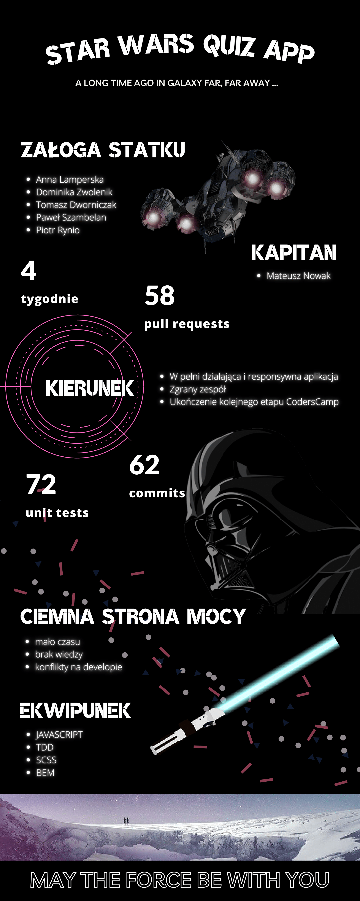

# Star Wars Quiz App

## Overview

**Star Wars Quiz App is a game that allows test your knowledge of the Star Wars saga. Are you already a Jedi or maybe Padawan so far?**

## Our Crew

The project was created during the **CodersCamp** course by a team led by **[Mateusz Nowak](https://github.com/nowakprojects)**

- [Anna Lamperska](https://github.com/lamparina)
- [Dominika Zwolenik](https://github.com/DomiZet)
- [Tomasz Dworniczak](https://github.com/tomdworniczak)
- [Paweł Szambelan](https://github.com/Szambelan)
- [Piotr Rynio](https://github.com/PiotrWR)

## Features

1. Selecting the quiz mode: People, Vehicles, Spaceships
2. Rules description for the quiz
3. Countdown after the start of the game (30 seconds)
4. The player tries to answer as many questions as possible. In addition, the player can also competes with the computer.
5. During the quiz, the Lightsaber shows how much time is left.
6. Random generation of questions within the selected mode.
7. When the time is completed, the player's score is stored in the ranking for given browser (LocalStorage) and the top 3 scores is shown.

**Our application is fully responsive and covered by Unit Tests!**

## Running the project

Running this project locally

###### Live version:

[Star Wars Quiz App](https://nowakprojects.github.io/CodersCamp2020.Project.JavaScript.StarWarsQuiz/)

###### From the repo:

1. Clone this project locally
2. Run `npm install` in your bash/command line
3. Run `npm run start:dev` in your bash/command line
4. Host a game and invite some friends!

## Dependencies

The following technologies were used :

- HTML
- CSS
- JavaScript
- [Jest](https://jestjs.io/) and [Testing Library](https://testing-library.com/docs/)
